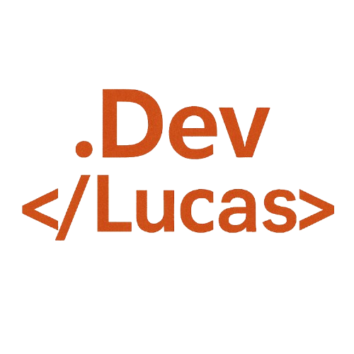

# 🏆 Portfólio - Lucas Henrique

  

 

## Aplicação em Desenvolvimento com o uso de Novas tecnologias e Funcionalidades

  ++🧠;" />

 

Esta é a V2 do meu portfólio pessoal, criado com <strong>HTML, CSS e JavaScript e Angular</strong>, com o objetivo de apresentar:

- 👨‍💼 Minha trajetória e experiência na área de desenvolvimento
- 🚀 Habilidades técnicas e tecnologias que domino
- 🛠️ Projetos desenvolvidos
- 📞 Meios de contato para oportunidades

A proposta do portfólio é ser leve, responsivo e de fácil navegação, proporcionando uma ótima experiência ao visitante.

 
 

## 🧑‍💻 Autor

* **Nome:** Lucas Henrique
* **E-mail:** lucas.dev.contato@outlook.com
* [LinkedIn](https://www.linkedin.com/in/lucas-henrique-sousa-mendes/)
