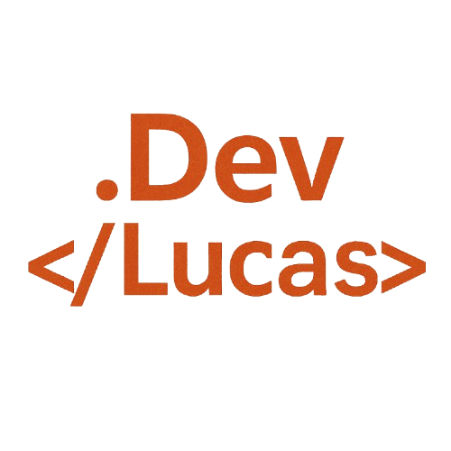

# 🏆 Portfólio - Lucas Henrique

<div style="text-align: center">
  
</div>

<br>

<div align="center">

**Portfólio profissional moderno, responsivo e performático**

<a href="#deploy">🚀 Acesse a aplicação</a> • <a href="#sobre">📖 Sobre</a> • <a href="#tecnologias">⚙️ Tecnologias</a> • <a href="#instalacao">💻 Como executar</a>

</div>

---

## 📋 Sobre

Esta é a **V2 do meu portfólio pessoal**, desenvolvido com **Angular 19** e as melhores práticas de engenharia front-end. É uma aplicação moderna que apresenta:

- 👨‍💼 Minha trajetória e experiência profissional
- 🚀 Habilidades técnicas e stack de desenvolvimento
- 🛠️ Projetos destacados com descrições e links
- 🎓 Certificações e formações
- 📞 Meios de contato para oportunidades
- 🌙 Tema claro/escuro com persistência

O design é responsivo, acessível e otimizado para performance, proporcionando uma experiência excelente em todos os dispositivos.

---

## <a id="deploy">🌐 Deploy</a>

Aplicação em produção:

> **URL:** [https://portfolio-lucas-henrique.netlify.app/](https://portfolio-lucas-henrique.netlify.app/)

A aplicação está hospedada no **GitHub Pages** e é atualizada automaticamente a cada push na branch `main`.

---

## <a id="tecnologias">⚙️ Tecnologias Utilizadas</a>

### Frontend
- **Angular** 19.2.13
- **TypeScript** 5.6
- **SCSS** (CSS pré-processado)
- **Bootstrap** 5.3.5
- **RxJS** 7.8

### Bibliotecas & Dependências
- **FontAwesome** 5.3.1 (ícones)
- **Google Fonts** (Sora, Space Grotesk)

### Ferramentas de Desenvolvimento
- **Angular CLI** 19.2.13
- **Node.js** & **npm**
- **Git** & **GitHub**

### Recursos Implementados
- ✅ Tema claro/escuro com persistência em localStorage
- ✅ Animações suaves (typing effect, scroll-reveal, counter)
- ✅ Design responsivo (mobile, tablet, desktop)
- ✅ IntersectionObserver para animations otimizadas
- ✅ Favicon e web manifest completos
- ✅ Otimização de CSS com orçamento de bundle
- ✅ Acessibilidade (labels, aria-label, semântica)

---

## <a id="instalacao">💻 Como executar localmente</a>

### Pré-requisitos
- Node.js 18+ instalado
- npm ou yarn

### Passos

1. **Clone o repositório**
   ```bash
   git clone https://github.com/terchaki/Portfolio-Lucas.git
   cd Portfolio-Lucas
   ```

2. **Instale as dependências**
   ```bash
   npm install
   ```

3. **Inicie o servidor de desenvolvimento**
   ```bash
   npm start
   ```
   A aplicação estará disponível em `http://localhost:4200/`

4. **Build para produção**
   ```bash
   npm run build
   ```
   Os arquivos compilados estarão em `dist/browser/`

---

## 📁 Estrutura do Projeto

```
src/
├── app/
│   ├── layouts/
│   │   ├── header/          # Navegação e toggle de tema
│   │   ├── footer/          # Rodapé com contatos
│   │   └── layout/          # Componente principal (hero, about, projects, etc)
│   ├── features/            # Módulos de funcionalidades
│   └── app.module.ts        # Módulo raiz
├── assets/
│   ├── icons/              # Favicon e PWA icons
│   └── images/             # Imagens estáticas
├── styles.scss             # Estilos globais e CSS variables
└── index.html              # Entrada HTML
```

---

## 📊 Performance

- **Bundle Size:** ~529 kB (estimado para transfer: ~103 kB)
- **Tempo de Compilação:** ~4s (produção)
- **LCP Target:** Otimizado com lazy loading e code splitting
- **CSS Budget:** 8.26 kB por componente

---

## 📝 Seções do Portfólio

- **Hero:** Apresentação principal com CTA buttons
- **Sobre:** Perfil profissional e formação acadêmica
- **Habilidades:** Stack técnico com 11+ tecnologias
- **Empresas:** Logos das empresas onde trabalhei
- **Projetos:** Showcase de 3 projetos destacados com links
- **Experiência:** Timeline com histórico profissional
- **Certificações:** Cursos e certificações incluindo GitHub Copilot
- **Contato:** CTA para enviar email

---

## 🧑‍💻 Autor

| Campo | Informação |
|-------|-----------|
| **Nome** | Lucas Henrique |
| **Profissão** | Desenvolvedor Front-end Angular |
| **E-mail** | lucas.dev.contato@outlook.com |
| **LinkedIn** | [lucas-henrique-sousa-mendes](https://www.linkedin.com/in/lucas-henrique-sousa-mendes/) |
| **GitHub** | [terchaki](https://github.com/terchaki) |

---

## 📄 Licença

Este projeto é de código aberto e disponível sob a licença MIT.

---

<div align="center">
  <strong>⭐ Se este portfólio foi útil, considere deixar uma star!</strong>
</div>
